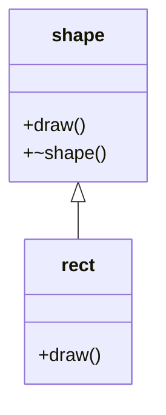

# Runtime Polymorphism: Shape and Rectangle

> Demonstrates inheritance and virtual function overriding with a base-class pointer calling a derived-class implementation.

## 🧩 Problem / Question

Write a C++ program that defines a base `shape` class with a virtual `draw()` function and a derived `rect` class that overrides `draw()`, then invoke `draw()` through a base-class pointer.

## 🎯 Objective

Show how inheritance and virtual functions are used to model runtime polymorphism.

## 🧠 Concepts Used

- Classes and objects
- Inheritance
- Virtual functions
- Function overriding
- Base pointer and dynamic dispatch
- Constructors/destructors concept (destructor presence)

## 💡 Approach

The program defines a `shape` class and a derived `rect` class. Both contain `draw()` implementations, where `rect` overrides the base behavior. The `main()` function uses pointers and attempts to call `draw()` through the base pointer.

## 🔍 How It Works

1. A base class `shape` is declared with virtual `draw()`.
2. A derived class `rect` overrides `draw()`.
3. `main()` declares pointers for base and derived types.
4. The base pointer is used to call `draw()`.



## 📥 Input

No user input.

## 📤 Output

Text output showing which `draw()` implementation is invoked.

## 🧪 Example

### Input

```text
(No input)
```

### Output

```text
without virtual function :drawing a rect by derived class:
```

## 📊 Complexity Analysis

| Complexity | Analysis |
| ---------- | -------- |
| Time       | O(1)     |
| Space      | O(1)     |

## 💻 Implementation

[View C++ Solution](./solution.cpp)

## 🎤 Interview Perspective

### What This Demonstrates

Basic understanding of inheritance and how virtual methods enable polymorphic behavior.

### Important Concepts

A base pointer can invoke overridden methods in derived classes when the function is virtual.

### Possible Follow-Up Questions

* Why should a polymorphic base class typically have a virtual destructor?
* What is the difference between compile-time and runtime polymorphism?
* What happens if `draw()` is not declared virtual?

## 🔧 Possible Improvements

- Fix pointer/object declarations in `main()` so the program is valid and compilable.
- Update the message `without virtual function :` to correctly reflect virtual dispatch.
- Use clearer variable names to avoid shadowing class names.

## 📌 Key Takeaways

* Virtual functions support runtime polymorphism.
* Inheritance allows derived classes to customize base behavior.
* Correct object-pointer binding is required for a valid demonstration.
