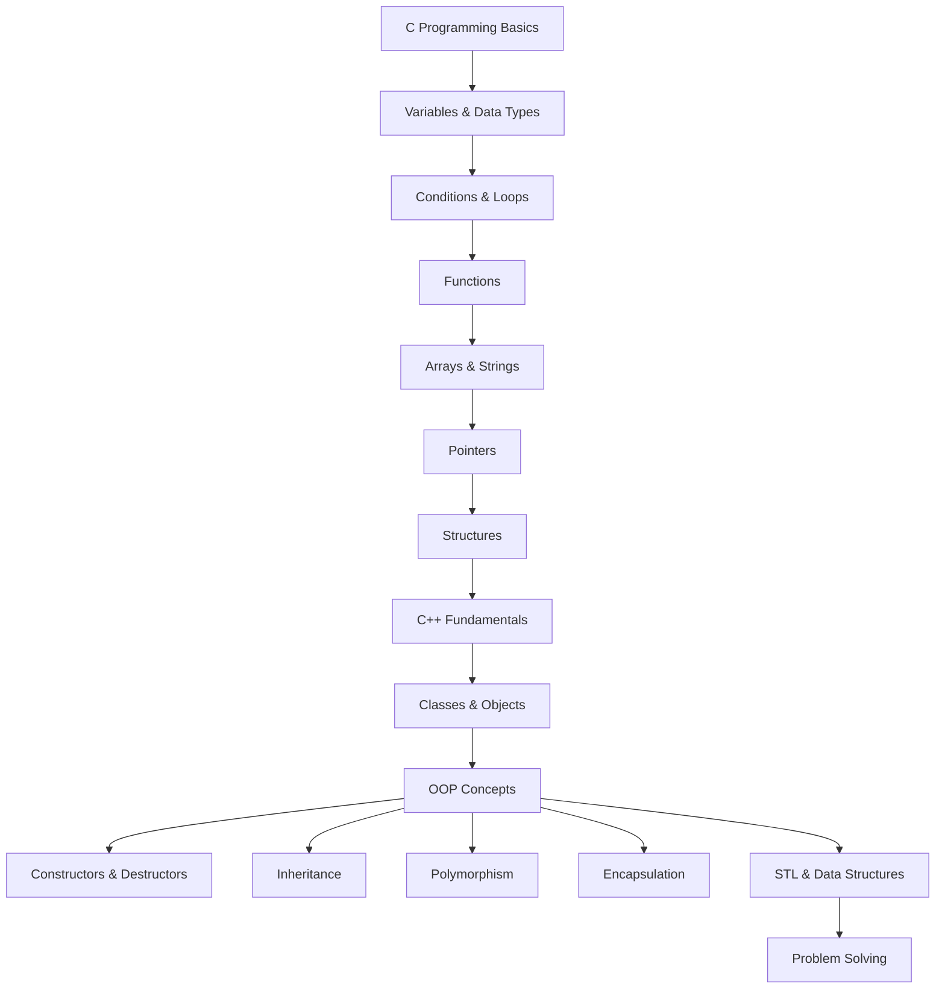

# Basic-with-C-and-C++
# 💻 C & C++ Programming Fundamentals

> A collection of my early programming exercises and experiments while learning the fundamentals of **C and C++ programming**.

This repository contains the programs I wrote while learning programming from the basics. It includes fundamental syntax, problem-solving exercises, object-oriented programming, data structures, and other concepts explored during the learning process.

The goal of this repository is not to showcase polished production software, but to document my **progress from programming fundamentals toward more advanced software development concepts**.

---

## 🌱 Learning Journey

I started with basic programming concepts and gradually explored more advanced topics.



---

# 📚 Concepts Covered

This repository contains programs covering different stages of my programming learning journey.

## 🔹 C Programming

* Basic syntax
* Variables
* Data types
* Operators
* Input and output
* Conditional statements
* Loops
* Functions
* Arrays
* Strings
* Pointers
* Structures
* Basic memory concepts

---

## 🔹 C++ Programming

* C++ syntax
* Input/output
* Functions
* References
* Arrays
* Strings
* Classes
* Objects
* Constructors
* Destructors
* Encapsulation
* Inheritance
* Polymorphism
* Function overloading
* Operator overloading
* Templates
* Exception handling
* Standard Template Library (STL)

---

# 🧱 Object-Oriented Programming

Some of the programs in this repository were created while learning **Object-Oriented Programming (OOP)** in C++.

The major concepts explored include:

| Concept           | Description                                                   |
| ----------------- | ------------------------------------------------------------- |
| **Class**         | Blueprint for creating objects                                |
| **Object**        | Instance of a class                                           |
| **Encapsulation** | Combining data and behavior together                          |
| **Inheritance**   | Reusing and extending existing classes                        |
| **Polymorphism**  | Allowing different implementations through a common interface |
| **Abstraction**   | Hiding unnecessary implementation details                     |
| **Constructor**   | Initializes an object                                         |
| **Destructor**    | Performs cleanup when an object is destroyed                  |

---

# 🧠 Programming Fundamentals

The early programs focus on building fundamental programming skills.

Examples include:

```text
Variables
   ↓
Operators
   ↓
Conditions
   ↓
Loops
   ↓
Functions
   ↓
Arrays
   ↓
Strings
   ↓
Pointers
   ↓
Structures
```

These concepts form the foundation for understanding more advanced programming and data structures.

---

# 🔍 Problem-Solving Practice

Many programs in this repository are small exercises designed to practice programming logic.

Examples of the types of problems explored include:

* Number manipulation
* Pattern printing
* Searching
* Sorting
* Array operations
* String operations
* Mathematical problems
* Recursion
* Function-based problems
* Object-oriented exercises
* Basic data structure implementations

The emphasis is on understanding **how to translate a problem into code**.

---

# 🧩 Data Structures & Algorithms

As the learning progressed, the repository also includes implementations and experiments involving fundamental data structures and algorithms.

Possible areas include:

* Arrays
* Linked Lists
* Stacks
* Queues
* Searching
* Sorting
* Recursion
* Trees
* Graphs

The implementations are primarily intended for **learning and experimentation**.

---

# 📂 Repository Organization

The repository may contain programs from different stages of learning.

A typical organization can look like:

```text
.
├── C/
│   ├── basics/
│   ├── conditions/
│   ├── loops/
│   ├── functions/
│   ├── arrays/
│   ├── strings/
│   ├── pointers/
│   └── structures/
│
├── C++/
│   ├── basics/
│   ├── functions/
│   ├── classes/
│   ├── constructors/
│   ├── inheritance/
│   ├── polymorphism/
│   ├── templates/
│   └── STL/
│
├── OOP/
│   ├── encapsulation/
│   ├── inheritance/
│   ├── polymorphism/
│   └── abstraction/
│
└── README.md
```

The actual structure may evolve as new concepts are learned.

---

# 📈 Learning Progress

This repository represents a progression rather than a collection of unrelated programs.

```mermaid
flowchart LR
    A[First Program] --> B[Programming Basics]
    B --> C[Logical Thinking]
    C --> D[Functions]
    D --> E[Arrays & Strings]
    E --> F[Pointers & Memory]
    F --> G[C++]
    G --> H[OOP]
    H --> I[Data Structures]
    I --> J[Algorithms]
    J --> K[Advanced Problem Solving]
```



Each stage builds upon concepts learned earlier.

---

# 🎯 What I Am Building Through This Repository

The purpose of these programs is to develop a strong foundation in:

* **Programming fundamentals**
* **Logical thinking**
* **Problem solving**
* **Object-oriented programming**
* **Data structures**
* **Algorithms**
* **Memory management**
* **Writing and understanding code**
* **Debugging**
* **Understanding complexity**

---

# 🛠️ Technologies

| Technology | Purpose                                                       |
| ---------- | ------------------------------------------------------------- |
| **C**      | Programming fundamentals and low-level concepts               |
| **C++**    | Object-oriented programming and advanced programming concepts |
| **STL**    | Working with common data structures and algorithms            |
| **Git**    | Version control                                               |
| **GitHub** | Code hosting and learning portfolio                           |

---

# 💡 Why This Repository Exists

This repository documents my progression as I learned programming.

Some programs may be simple, experimental, or written in different styles. That is intentional: they represent different stages of understanding.

Instead of hiding the early learning process, this repository shows the progression from:

> **Writing my first programs → understanding programming fundamentals → learning OOP → working with data structures → solving algorithmic problems.**

---

# 🚀 Future Direction

The next stage of this learning journey is to build upon these fundamentals and focus more heavily on:

* Advanced Data Structures
* Algorithms
* Competitive Programming
* Problem Solving
* System Design Fundamentals
* Clean Code
* Software Engineering Practices
* Real-world C++ projects

---

# 📌 Learning Philosophy

> **Understand the concept first. Write the code second. Optimize after understanding.**

The objective is not simply to make programs work, but to understand:

* Why they work
* How they work
* What happens internally
* What could be improved
* How the same concept applies to larger problems

---

# 👨‍💻 About This Repository

This repository represents the **foundation of my programming journey**.

The programs here helped me move from learning basic syntax to understanding programming concepts such as **functions, pointers, classes, objects, inheritance, polymorphism, data structures, and algorithms**.

As my skills develop, this repository will gradually evolve from basic learning exercises into more structured algorithmic solutions and real-world projects.

---

## ⭐ Progress Over Perfection

The most important part of this repository is the progression.

```text
Learn
  ↓
Practice
  ↓
Make Mistakes
  ↓
Understand
  ↓
Improve
  ↓
Build
```

**This repository is a record of that journey.**

